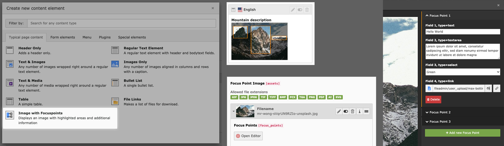

Examples
========

Default frontend output
-----------------------

This example uses the bundled sample field configuration and the default Fluid
template.

..  figure:: ../Images/example_frontend.png
    :alt: Default frontend rendering with focus rectangles
    :class: with-shadow

Animated SVG example
--------------------

The focus areas can also be rendered with custom SVG animation and
project-specific markup.

..  figure:: ../Images/example_animation.gif
    :alt: Animated frontend example
    :class: with-shadow

Annotated manual screenshots
----------------------------

The extension also works well for documentation or tutorial screenshots where
focus areas reveal additional explanations.

..  figure:: ../Images/example_manual.png
    :alt: Example usage for annotated manual screenshots
    :class: with-shadow

Backend editing view
--------------------

Editors manage the rectangles and related metadata directly on the file
reference in the TYPO3 backend.

