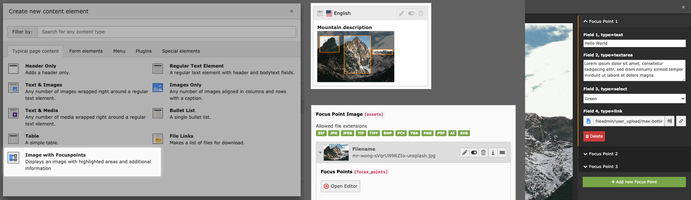

===============================
TYPO3 Extension: Focus Point Images
===============================

:Extension key:
   bw_focuspoint_images

:Package name:
   blueways/bw-focuspoint-images

:Version:
   |release|

:Language:
   en

:Author:
   Maik Schneider, XIMA MEDIA GmbH

:License:
   This document is published under the
   `GNU General Public License v2.0 or later <https://www.gnu.org/licenses/gpl-2.0.html>`__.

:Rendered:
   |today|

----

Create responsive image maps with focus points in the TYPO3 backend. This extension provides an image editor
that allows you to add areas and information to images.

----

**Table of Contents:**

.. contents::
   :backlinks: top
   :depth: 2

Introduction
===========

What does it do?
---------------

The extension "Focus Point Images" allows you to create responsive image maps directly in the TYPO3 backend.
It provides a custom image editor to add interactive areas with additional information to images. These focus points
can be animated and displayed in various ways in the frontend.

Screenshots
----------

Backend Editor
^^^^^^^^^^^^^

.. figure:: Images/example_backend.png
   :alt: Backend Editor
   :class: with-shadow

   The backend editor for adding focus points to images

Frontend Examples
^^^^^^^^^^^^^^^^

Example 1: Default Output
""""""""""""""""""""""""

.. figure:: Images/example_frontend.jpg
   :alt: Default Frontend Output
   :class: with-shadow

   Frontend output with default configuration

Example 2: SVG Animation
"""""""""""""""""""""""

.. figure:: Images/example_animation.gif
   :alt: SVG Animation Example
   :class: with-shadow

   Focus areas animated via SVG with delayed information display

Usage
=====

Adding Focus Points to Images
---------------------------

1. Add the new content element "Image with Focuspoints" to any page
2. Select an image
3. Use the editor to add focus areas to your image

   Backend view of the focus point editor

For Developers
=============

Database Structure
----------------

The table ``sys_file_references`` is extended with the field ``focus_points``. This field stores the settings made in the backend editor in JSON format.

Integrating with Custom Content Elements
--------------------------------------

To use the editor in other content elements with FAL images, use the following TCA to activate the palette:

.. code-block:: php

   $GLOBALS['TCA']['tt_content']['types']['your_list_type']['columnsOverrides'] = [
       'assets' => [
           'config' => [
               'overrideChildTca' => [
                   'types' => [
                       \TYPO3\CMS\Core\Resource\File::FILETYPE_IMAGE => [
                           'showitem' => 'focus_points,--palette--;;filePalette'
                       ],
                   ],
                   'columns' => [
                       'uid_local' => [
                           'config' => [
                               'appearance' => [
                                   'elementBrowserAllowed' => $GLOBALS['TYPO3_CONF_VARS']['GFX']['imagefile_ext']
                               ],
                           ],
                       ],
                   ],
               ]
           ]
       ]
   ];

This snippet assumes that references are done via the ``assets`` column. Adjust this to your specific needs.

Using Focus Point Data in Templates
--------------------------------

To decode the JSON data and use the information in your template, use the ``FocuspointProcessor``:

.. code-block:: typoscript

   tt_content.your_list_type {
       dataProcessing {
           15 = Blueways\BwFocuspointImages\DataProcessing\FocuspointProcessor
           15 {
               references.fieldName = assets
               as = image
           }
       }
   }

Contributing
===========

This extension was created by Maik Schneider. Contributions are welcome!

Thanks to `blueways <https://www.blueways.de/>`__ and `XIMA <https://www.xima.de/>`__ for supporting this project.

Issues and Pull Requests can be submitted at the extension's repository.

..  toctree::
    :hidden:

    Introduction/Index
    Installation/Index
    Configuration/Index
    Usage/Index
    DeveloperCorner/Index
    Migration/Index
    Contributing/Index

..  toctree::
    :hidden:

    Sitemap