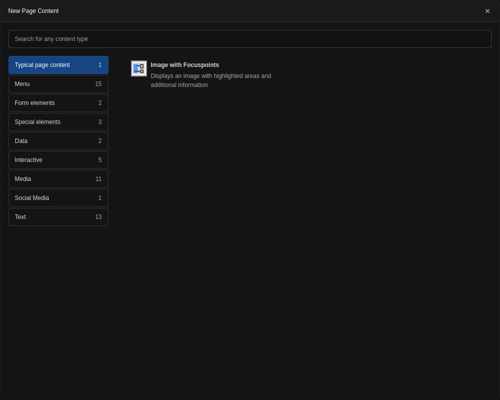

Overview
====================

With this TYPO3 extension you can create responsive image maps in the
backend. This extension ships an image editor that can be used to add
interactive clickable areas and information to an image.

.. figure:: ./Images/example_backend.png
   :alt: Editor in the backend
   :class: with-shadow

Examples
--------

.. _example:

Example
~~~~~~~~~~~~~~~~~~~~~~~~~

Frontend output with configuration of :ref:`example PageTS <pagets_fields>`

.. figure:: ./Images/example_frontend.png
   :alt: Frontend output example 1
   :class: with-shadow

For administrators
==================

Installation
------------

.. rst-class:: bignums

1. Install via composer

   .. code:: bash

      composer require blueways/bw-focuspoint-images

2. Include TypoScript

   Enable the extension in the Extension Manager and include the **static TypoScript template** or manually include setup and constants.

3. Define your own wizard fields

   There are **no default fields** defined! An example with working frontend output can be found here: :ref:`pagets_fields`

Usage
-----

Add the new content element “Image with Focuspoints” to any page, link a new
image and start adding your focus areas.

Configuration
-------------

.. _pagets_fields:

PageTS
~~~~~~

To configure the fields in the focus point wizard, use the following **PageTS** settings. You can choose between **text**, **textarea**, **select** and **link** inputs in the wizard.

This example configuration is used to generate the output shown in :ref:`Example 1 <example1>`.

.. code:: typoscript

    mod.tx_bwfocuspointimages.settings.fields {
        link {
            title = LLL:EXT:bw_focuspoint_images/Resources/Private/Language/locallang_db.xlf:wizard.fields.link
            type = link
        }
        title {
            title = LLL:EXT:bw_focuspoint_images/Resources/Private/Language/locallang_db.xlf:wizard.fields.title
            type = text
        }
    }

Adjusting the link wizard
+++++++++++++++++++++++++

You can customize the display of the link wizard. Use the additional ``linkPopup`` to change the list of allowed file extensions, the displayed link fields or link options. The configuration is done like for `link inputs <https://docs.typo3.org/m/typo3/reference-tca/master/en-us/ColumnsConfig/Type/Input/Properties/LinkPopup.html>`__.

.. code:: typoscript

   mod.tx_bwfocuspointimages.settings.fields {

       email {
           title = Hide all wizard tabs but email
           type = link
           linkPopup {
               blindLinkOptions = file, folder, page, spec, telephone, url
           }
       }

       pdf {
           title = Only files of .pdf or .docx extension
           type = link
           linkPopup {
               blindLinkFields = pdf, docx
               blindLinkOptions = email, folder, page, spec, telephone, url
               blindLinkFields = class, params, target, title
           }
       }

   }

Constants
~~~~~~~~~

To override templates set your own paths via constants:

.. code:: typoscript

   plugin.tx_bwfocuspointimages {
       view {
           templateRootPath =
           partialRootPath =
           layoutRootPath =
       }
   }

.. tip::

   To use the default rendering of **fluid_styled_content**, set Layout and Partial path to your styles.content setting and use the **Default** layout in your **FocuspointImage** template file.

For developers
==============

The table :file:`sys_file_references` becomes extended for the field :file:`focus_points`. This field is used to save the settings made in the backend editor in json format.

To use the editor in other content elements with FAL images, use the following TCA to activate the palette:

.. code-block:: php

   $GLOBALS['TCA']['tt_content']['types']['your_list_type']['columnsOverrides'] = [
       'assets' => [
           'config' => [
               'overrideChildTca' => [
                   'types' => [
                       \TYPO3\CMS\Core\Resource\File::FILETYPE_IMAGE => [
                           'showitem' => 'focus_points,--palette--;;filePalette'
                       ],
                   ],
                   'columns' => [
                       'uid_local' => [
                           'config' => [
                               'appearance' => [
                                   'elementBrowserAllowed' => $GLOBALS['TYPO3_CONF_VARS']['GFX']['imagefile_ext']
                               ],
                           ],
                       ],
                   ],
               ]
           ]
       ]
   ];

To decode the json format and use relative points in your fluid template, use the :file:`FocuspointProcessor`:

.. code-block:: typoscript

   tt_content.your_list_type {
      dataProcessing {
         15 = Blueways\BwFocuspointImages\DataProcessing\FocuspointProcessor
         15 {
            references.fieldName = assets
            as = image
         }
      }
   }

.. note::
   These snippets assume that references are done via :file:`assets` column. Change this to your needs.

Upgrade
=======

To version 5.x
---------------
The rectangular shapes were replaced with custom polygon areas.

The JSON schema for the column `focus_points` was changed. Objects do not have the properties `x`, `y`, `width` and `height`. Instead, they must be replaced with a property `points` that contains an array of two-dimensional points.

Default fields like `name`, `description`, `color`, `hasLink` were deleted but they can be created per project anyways,

The default Fluid template renders only polygons and links. You must override them if you need extra fields to be rendered.

Fixed a visual bug, when the `<svg>` element couldn't fully overlap the `` when the image's width is not 100%. All images by default habe the width of 100%.

To version 4.x
---------------

TypoScript paths changed:

Old: ``EXT:bw_focuspoint_images/Configuration/setup.txt``
New: ``EXT:bw_focuspoint_images/Configuration/setup.typoscript``

To version 3.x
---------------

In version ``3.0.0`` the configuration of focuspoint fields has been moved to **PageTS** in order to make different settings possible in the page tree.

Old TypoScript: ``plugin.tx_bwfocuspointimages.settings.fields..``

New PageTS: ``mod.tx_bwfocuspointimages.settings.fields..``

Just move your existing configuration to PageTS and adjust the prefix from ``plugin`` to ``mod``.

Contribute
==========

Feel free to contribute!

* `Bitbucket-Repository <https://github.com/maikschneider/bw_focuspoint_images/>`__

.. versionadded:: 2.2.0
   New link browser for the Focuspoint Wizard

.. versionadded:: 2.3.0
   Support for TYPO3 v10

.. versionadded:: 2.3.1
   Bugfix for missing TypoScript include at root page

.. versionadded:: 3.0.0
   Native link browser: Supports all configured LinkBrowsers (e.g. Files), drop support of TYPO3 v7 & v8, new backend preview

.. versionadded:: 4.0.0
    TYPO3 v12 support

.. versionadded:: 5.0.0
    Replace rectangular areas with custom polygon forms
