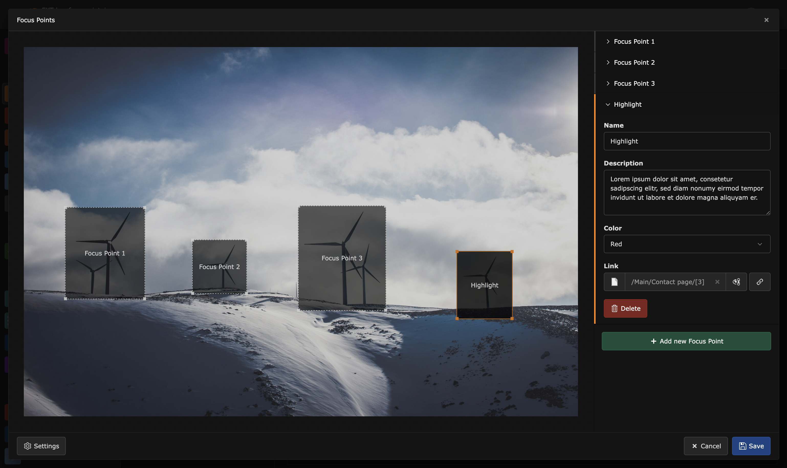

Bw Focuspoint Images
====================

`bw_focuspoint_images` adds an image editor to TYPO3 that lets editors define
draggable focus areas on an image and enrich each area with custom metadata.
The extension ships with a ready-to-use content element, a backend preview, and
an API for integrating the editor into custom FAL-based records.

    The focuspoint wizard combines rectangle editing with configurable metadata
    fields.

Highlights
----------

- Configurable wizard fields via PageTS
- Supported field types: `text`, `textarea`, `rte`, `select`, `link`,
  `checkbox`
- Ready-to-use content element: **Image with Focuspoints**
- Flexible frontend rendering through Fluid and `FocuspointProcessor`
- Reusable TCA integration for your own FAL relations
- TYPO3 v13 and v14 support

..  toctree::
    :maxdepth: 2
    :titlesonly:

    Introduction/Index
    Installation/Index
    QuickStart/Index
    Configuration/Index
    Examples/Index
    Developer/Index
    Changelog/Index
