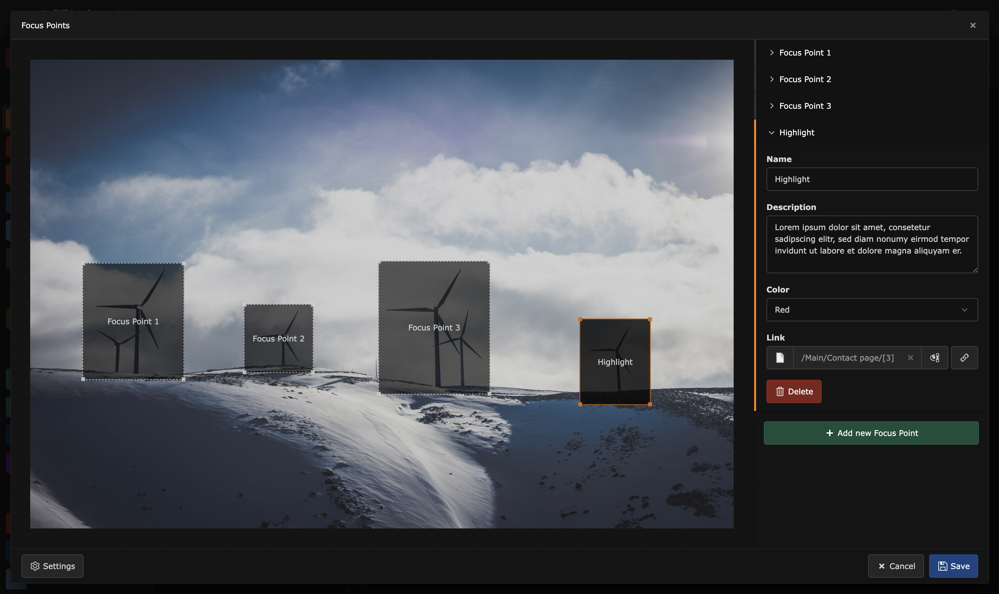

Overview
========

With this TYPO3 extension you can create responsive image maps in the
backend. This extension ships an image editor that can be used to add
areas and information to an image.



Examples
========

Example 1: Default output
-------------------------

Frontend output with configuration of example PageTS


Example 2: SVG Animation
------------------------

In this example the focus areas are animated via SVG. The additional
information are displayed next to the image with some delay.


For administrators
==================

### Installation

1.  Install via composer

    ``` {.bash}
    composer require blueways/bw-focuspoint-images
    ```

2.  Include TypoScript

    Enable the extension in the Extension Manager and include the
    **static TypoScript template** or manually include setup and
    constants.

3.  Define your own wizard fields

    There are **no default fields** defined! An example with working
    frontend output can be found in the PageTS section.

### Usage

Add the new content element "Image with Focuspoints" to any page, link a new
image and start adding your focus areas.


### Configuration

To configure the fields in the focus point wizard, use the following **PageTS** settings. You can choose between **text**, **textarea**, **select**, **link** and **checkbox** inputs in the wizard.

This example configuration is used to generate the output shown in Example 1

```typoscript
mod.tx_bwfocuspointimages.settings.fields {

    link {
        title = LLL:EXT:bw_focuspoint_images/Resources/Private/Language/locallang_db.xlf:wizard.fields.link
        type = link
    }
}
```

#### Field Display Conditions

You can use `displayCond` in your wizard field configuration to control when a field should be visible, similar to [TYPO3's TCA displayCond feature](https://docs.typo3.org/m/typo3/reference-tca/main/en-us/Columns/DisplayConditions.html).

```typoscript
mod.tx_bwfocuspointimages.settings.fields {
    description {
        title = Description
        type = textarea
        displayCond = FIELD:name:REQ:true  # Show only if name field has a value
    }
}
```

#### Field Overrides

You can override the default configuration of the fields on a per-element basis, similar to the TYPO3 TCEFORM configuration: `mod.tx_bwfocuspointimages.settings.fields.[fieldName].types.[typeName].[propertyName]`.

```
mod.tx_bwfocuspointimages.settings.fields {
    description {
        title = Description
        type = textarea
        types.my_custom_ctype.disabled = 1
    }

    title {
        title = Default Title
        types.tx_myextension_domain_model_mytype.title {
            title = Custom Title
            default = Custom Default
        }
    }
}
```

##### Adjusting the link wizard

You can customize the display of the link wizard. Use the additional ```linkPopup``` to change the list of allowed file extensions, the displayed link fields or link options. The configuration is done like for [link inputs](https://docs.typo3.org/m/typo3/reference-tca/11.5/en-us/ColumnsConfig/Type/Input/Properties/LinkPopup.html#linkpopup).

```typoscript
mod.tx_bwfocuspointimages.settings.fields {

    email {
        title = Hide all wizard tabs but email
        type = link
        linkPopup {
            blindLinkOptions = file, folder, page, spec, telephone, url
        }
    }

    pdf {
        title = Only files of .pdf or .docx extension
        type = link
        linkPopup {
            blindLinkFields = pdf, docx
            blindLinkOptions = email, folder, page, spec, telephone, url
            blindLinkFields = class, params, target, title
        }
    }

}
```

#### Constants

To override templates set your own paths via constants:

```typoscript
plugin.tx_bwfocuspointimages {
    view {
        templateRootPath =
        partialRootPath =
        layoutRootPath =
    }
}
```

For developers
==============

The table `sys_file_references` becomes
extended for the field `focus_points`. This field is used to save the settings made in the backend editor in json format.

To use the editor in other content elements with FAL images, use the
following TCA to activate the palette:

```php
$GLOBALS['TCA']['tt_content']['types']['your_list_type']['columnsOverrides'] = [
    'assets' => [
        'config' => [
            'overrideChildTca' => [
                'types' => [
                    \TYPO3\CMS\Core\Resource\File::FILETYPE_IMAGE => [
                        'showitem' => 'focus_points,--palette--;;filePalette'
                    ],
                ],
                'columns' => [
                    'uid_local' => [
                        'config' => [
                            'appearance' => [
                                'elementBrowserAllowed' => $GLOBALS['TYPO3_CONF_VARS']['GFX']['imagefile_ext']
                            ],
                        ],
                    ],
                ],
            ]
        ]
    ]
];
```

This snippet assumes that references are done via `assets` column. Change this to your needs.

To decode the JSON data and use the information in your template, use the `FocuspointProcessor`:

```typoscript
tt_content.your_list_type {
    dataProcessing {
        15 = Blueways\BwFocuspointImages\DataProcessing\FocuspointProcessor
        15 {
            references.fieldName = assets
            as = image
        }
    }
}
```

License
=======

This project is licensed under [GNU General Public License 2.0 (or later)](LICENSE.md).

Contribute
==========

This extension was made by Maik Schneider: Feel free to contribute!

Please have a look at [`CONTRIBUTING.md`](CONTRIBUTING.md).

Thanks to [blueways](https://www.blueways.de/) and [XIMA](https://www.xima.de/)!
