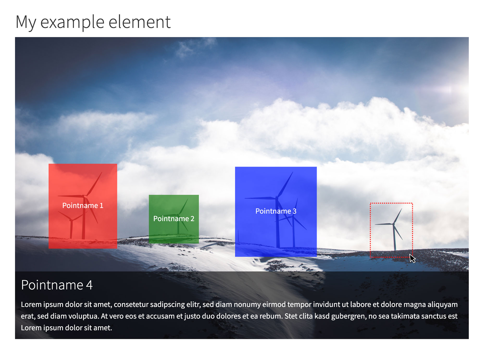

Overview
========

With this TYPO3 extension you can create responsive image maps in the
backend. This extension ships an image editor that can be used to add
areas and information to an image.


Examples
========

Example 1: Default output
-------------------------

Frontend output with included example TypoScript setup



Example 2: SVG Animation
------------------------

In this example the focus areas are animated via SVG. The additional
information are displayed next to the image with some delay.


For administrators
==================

### Installation

1.  Install via composer

    ``` {.bash}
    composer require blueways/bw-focuspoint-images
    ```

2.  Include TypoScript

    Enable the extension in the Extension Manager and include the
    **static TypoScript template** or manually include setup and
    constants.

3.  Define your own wizard fields

    There are **no default fields** defined! An example with working
    frontend output can be found in the setup section.

### Usage

Add the new content element "SVG Focuspoints" to any page, link a new
image and start adding your focus areas.

### Configuration

#### Setup

To configure the fields in the focus point wizard, use the following
TypoScript settings. You can choose between **text**, **textarea** and
**select** inputs in the wizard.

This example setup is used to generate the output shown in Example 1

``` {.typoscript}
plugin.tx_bwfocuspointimages.settings.fields {

    name {
        title = LLL:EXT:bw_focuspoint_images/Resources/Private/Language/locallang_db.xlf:wizard.fields.name
        type = text
    }

    description {
        title = LLL:EXT:bw_focuspoint_images/Resources/Private/Language/locallang_db.xlf:wizard.fields.description
        type = textarea
    }

    color {
        title = LLL:EXT:bw_focuspoint_images/Resources/Private/Language/locallang_db.xlf:wizard.fields.color
        type = select
        options {
            red = LLL:EXT:bw_focuspoint_images/Resources/Private/Language/locallang_db.xlf:wizard.fields.color.red
            green = LLL:EXT:bw_focuspoint_images/Resources/Private/Language/locallang_db.xlf:wizard.fields.color.green
            blue = LLL:EXT:bw_focuspoint_images/Resources/Private/Language/locallang_db.xlf:wizard.fields.color.blue
        }
    }

}
```

#### Constants

To override templates set your own paths via constants:

``` {.typoscript}
plugin.tx_bwfocuspointimages {
    view {
        templateRootPath =
        partialRootPath =
        layoutRootPath =
    }
}
```

To use the default rendering of **fluid\_styled\_content**, set Layout
and Partial path to your styles.content setting and use the **Default**
layout in your **FocuspointImage** template file.

For developers
==============

The table `sys_file_references` becomes
extended for the field `focus_points`. This field is used to save the settings made in the backend editor in json format.

To use the editor in other content elements with FAL images, use the
following TCA to activate the palette:

``` {.php}
$GLOBALS['TCA']['tt_content']['types']['your_list_type']['columnsOverrides'] = [
   'assets' => [
     'config' => [
         'foreign_types' => [
             \TYPO3\CMS\Core\Resource\File::FILETYPE_IMAGE => [
                 'showitem' => 'focus_points'
             ]
         ]
      ]
   ]
];
```

This snippet assumes that references are done via `assets` column. Change this to your needs.

Todos
=====

Possible improvements:

-   More frontend examples (e.g. svg animation, use of canvas
    element,..)
-   New field types for the wizard (e.g. PageTree)
-   DataProcessor for injecting data into the wizard
-   Better configuration of the custom tt\_content element (e.g.
    template selection, further display configuration)
-   \...

Contribute
==========

Feel free to contribute!

-   [Bitbucket-Repository](https://bitbucket.org/blueways/bw_focuspoint_images/)
