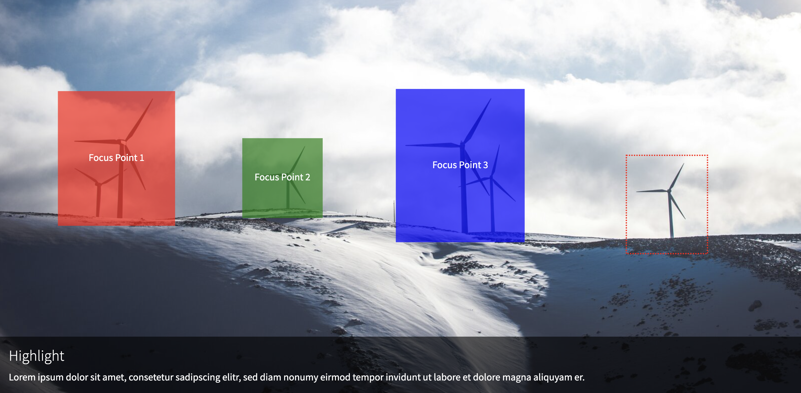
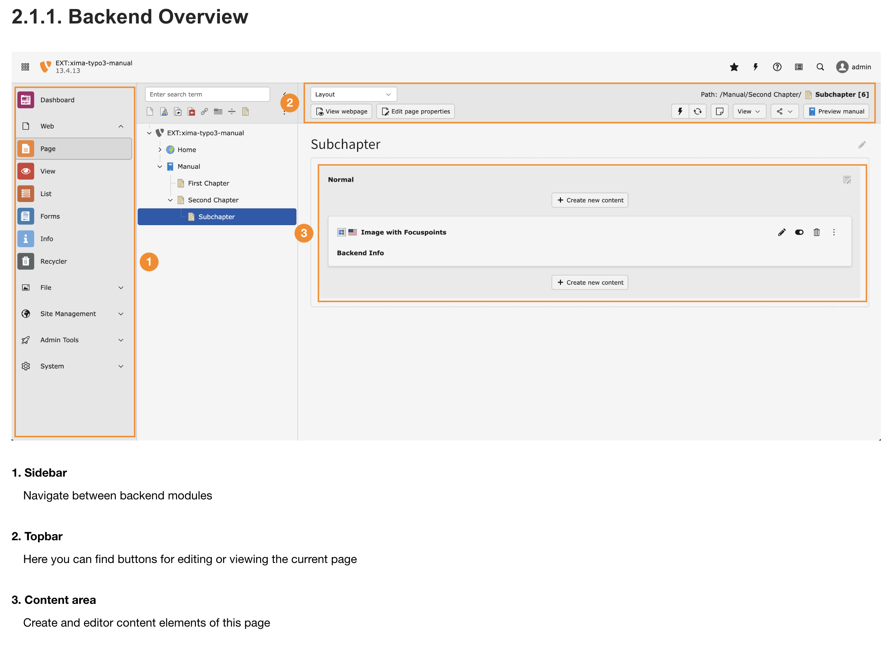

<div align="center">


# TYPO3 extension `bw_focuspoint_images`


[](https://extensions.typo3.org/extension/bw_focuspoint_images)

[](https://packagist.org/packages/blueways/bw-focuspoint-images)

</div>

`bw_focuspoint_images` adds an interactive image editor to TYPO3. Editors can
draw draggable focus areas on an image, enrich each area with custom metadata,
and render the result in Fluid with a ready-to-use `DataProcessor`.


## What It Does

- Adds the content element **Image with Focuspoints**
- Stores focus areas as JSON on `sys_file_reference.focus_points`
- Lets integrators define custom metadata fields in **PageTS**
- Supports `text`, `textarea`, `rte`, `select`, `link`, and `checkbox`
- Ships a default frontend rendering plus reusable `FocuspointProcessor`
- Can also be integrated into your own FAL-based content elements

## Requirements

- TYPO3 `^13.4` or `^14.2`
- Composer-based TYPO3 installation

## Installation

Install the extension with Composer:

```bash
composer require blueways/bw-focuspoint-images
```

Recommended TYPO3 setup:

1. Add the site set `blueways/bw-focuspoint-images`.
2. Optionally add `blueways/bw-focuspoint-images-example` for a ready-made demo field configuration.
3. Define your own PageTS field configuration if you do not use the example set.

Fallback for older or manual setups:

1. Include the static TypoScript template **Bw Focuspoint Images**.
2. Import the PageTS that enables the content element in the wizard:

```typoscript
@import 'EXT:bw_focuspoint_images/Configuration/TsConfig/Page/newContentElement.tsconfig'
```

## Quick Start

The extension ships with **no default wizard fields**. Define them in PageTS,
for example:

```typoscript
mod.tx_bwfocuspointimages.settings.fields {
    name {
        title = LLL:EXT:bw_focuspoint_images/Resources/Private/Language/locallang_db.xlf:wizard.fields.name
        type = text
        useAsName = 1
    }

    description {
        title = LLL:EXT:bw_focuspoint_images/Resources/Private/Language/locallang_db.xlf:wizard.fields.description
        type = textarea
    }

    color {
        title = LLL:EXT:bw_focuspoint_images/Resources/Private/Language/locallang_db.xlf:wizard.fields.color
        type = select
        options {
            red = Red
            green = Green
            blue = Blue
        }
        default = red
    }

    link {
        title = Link
        type = link
        displayCond = FIELD:color:=:red
    }

    notes {
        title = LLL:EXT:bw_focuspoint_images/Resources/Private/Language/locallang_db.xlf:wizard.fields.notes
        type = rte
    }
}
```

After that:

1. Create the content element **Image with Focuspoints**.
2. Add an image to the `assets` field.
3. Open the focuspoint editor, draw rectangles, and fill in the metadata.

## Frontend Rendering

The extension already ships a default Fluid template and TypoScript setup for
the bundled content element. If you want to reuse the data in your own content
element, use the `FocuspointProcessor`:

```typoscript
tt_content.your_list_type {
    dataProcessing {
        15 = Blueways\BwFocuspointImages\DataProcessing\FocuspointProcessor
        15 {
            references.fieldName = assets
            as = images
        }
    }
}
```

The processor decodes the JSON data and exposes the focus areas as `points`.
Coordinates are converted from normalized `0..1` values to percentages for
direct use in Fluid and SVG.

## Configuration Highlights

- `displayCond` supports operators such as `REQ`, `=`, `!=`, `>`, `<`, `>=`,
`<=`, `IN`, `!IN`, `-`, and `!-`
- `types.<typeName>.*` lets you override field settings per parent content type
- `linkPopup` customizes the TYPO3 link browser for `link` fields
- `richtextConfiguration` can be used for `rte` fields
- `plugin.tx_bwfocuspointimages.view.*RootPath` lets you override templates

The canonical example configuration lives in
[`Configuration/Sets/BwFocuspointImagesExample/page.tsconfig`](Configuration/Sets/BwFocuspointImagesExample/page.tsconfig).

## Screenshots

### Default frontend output



### Animated SVG example


### Tutorial-style annotations



## Documentation

Detailed TYPO3 documentation is available in
[`Documentation/Index.rst`](Documentation/Index.rst).

## Development

```bash
npm run build
npm run start
composer run sca
composer run php:fixer
composer run php:stan
composer run rector
```

## License

This project is licensed under the [GNU General Public License 2.0 or later](LICENSE.md).

## Credits

Created by Maik Schneider. Contributions are welcome via
[`CONTRIBUTING.md`](CONTRIBUTING.md).

Thanks to [blueways](https://www.blueways.de/) and [XIMA](https://www.xima.de/).
